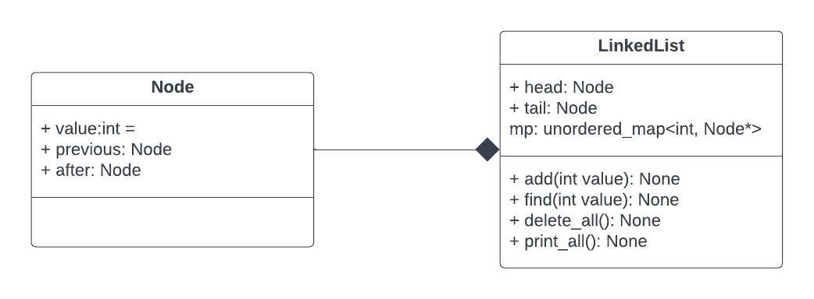
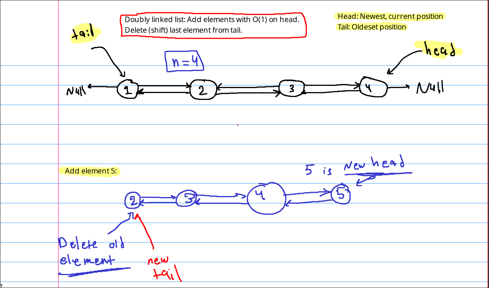
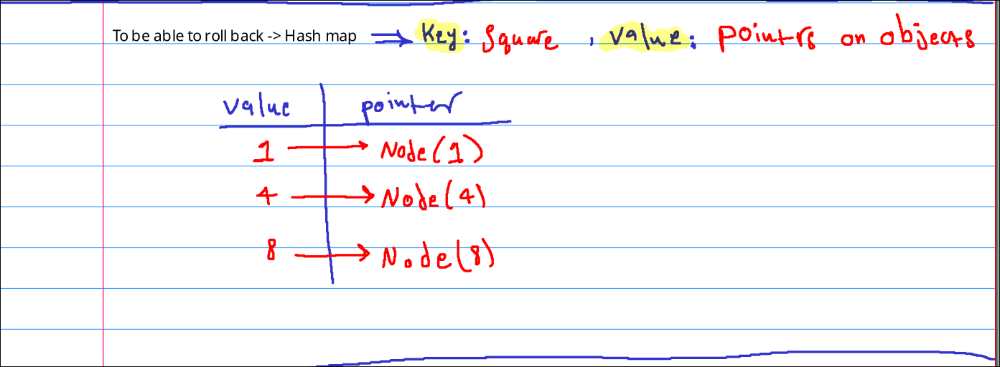
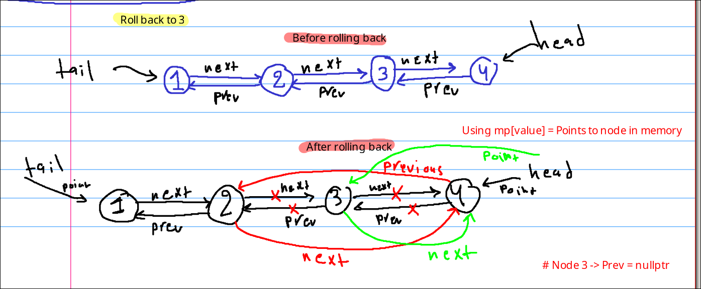

# **Task 1.0: Tired of Losing**

## **Overview**
You’re playing Simi-Monopoly… and losing. A lot.
It's hard because you are playing on linear board, so once you pass a square, there is no chance to get back to it.

So you decide to design a custom data structure that helps you recover by storing your last 10 positions on the board. This allows you to roll back to any previous position whenever things start going wrong, ** to avoid doubts, all processes must be done in constant time O(1).**

At each turn, you have two possible actions:

### **1. Play Normally (Roll the Dice) **
You move forward as usual, and your new position is added to your history.

```
Example:
Current positions:
[1, 4, 8, 9, 15, 16, 20, 23, 29, 32]

After rolling the dice and landing on 36:
[4, 8, 9, 15, 16, 20, 23, 29, 32, 36]

You are now on position 36.
```

### **2. Roll Back to a Previous Position**
You may return to any of your last 10 positions and treat it as your new current position.

```
Example:
Current positions:
[1, 4, 8, 9, 15, 16, 20, 23, 29, 32]

If you roll back to position 23
[1, 4, 8, 9, 15, 16, 20, 29, 32, 23]

You are now on position 23. (The position must be removed from middle and be appended to the end)
```

In addition to insure you are choosing the best move, you should have the ability to print all elements of that data structure in non-arbitrary order.

## Solution

* I implemented Doubly LinkedList with hash map for this task.
* The header will point to the newest node, while trailer points to old one.
* I used hash map to be able to roll_back with O(1) time complexity, by saving the value/sqaure for each node as key, and the address of the **Node(value)** object as value.
* C++ doesn't have garbage collector, used **delete** function to delete objects from trailer for memory efficiency.
* There are two main classes:
  
  1) `Node`: Determine prev, next, value for each node.
  2) `LinkedList`, consists of:
    
      1) `add(value)`: Add node at the header, and remove old node pointed to by trailer using `delete_node`.

      2) `find(value):`  for rolling_back

      3) `delete_node()`: delete node pointed to by trailer. 


Add method(value): Make head points to the new node, and delete node points to by tail.

Hash_map: Used to save square(value) as key, Node pointers as value.

Rolling_back(value): Connect previous node of node(value) with next node of node(value). Head will points to the node(value).

